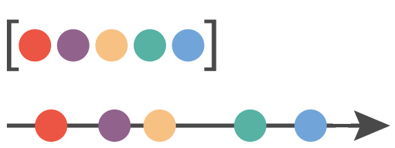
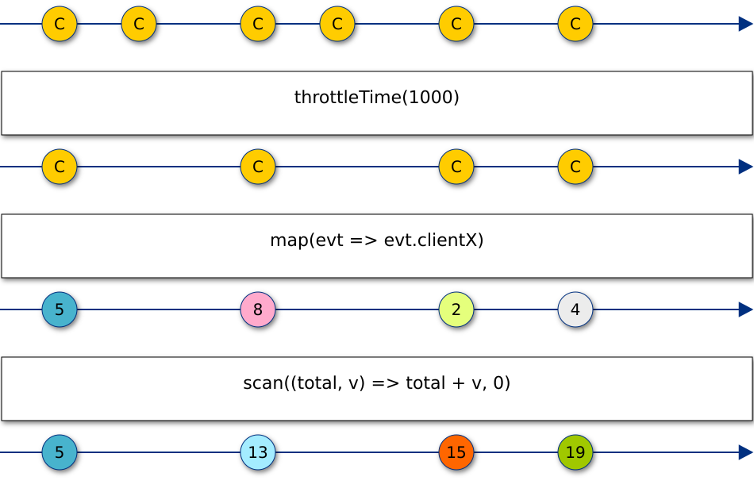

# Rx6, the coolest Rx evolution
Note:
Introduccion de RX
+ 
TOC
+ 
Motivación de esta charla
---

### Abraham Alcaina

@fa[twitter] @AbrahamAlcaina

@fa[github] AbrahamAlcaina

+++

### Víctor Oliva

@fa[twitter] @voliva_v

@fa[github] voliva

---
# Rx
@fa[arrow-down]

Note:
Juego stream levantar la mano 

+++

A Stream Everything Is

+++

Note:
In general, we can think of streams as values over time. If we compare it to an array, with an array we have all the
values toghether in a single time, while a stream we get new values as the time passes. Note that these values can be
arrays, or even other streams (so you can have an array of arrays or a stream of arrays or a stream of streams)

Arrays are used to hold a group of values. Streams represent new values over time. That's why they are specially suitable
for events, or data that changes over time.

+++
## Sources

- Events: fromEvent(document, 'click')
- Arrays: from([1,2,3,4])
- Service calls: SockJS/Socket.io/Stomp/etc.
- Promises
- Subjects

+++?code=presentation/assets/src/composition.js&lang=js&title=Composition

+++?code=presentation/assets/src/composition2.js&lang=js

@[1-14](Composition)

+++

+++
## Operators

- filter
- map
- reduce
- take
- buffer
- combineLatest
- concat
- debounce
- distinct
- publish

Note:
There are over 100 operators, but these are the most often used (or variations of these, like scan, bufferTime, throttle, debounceTime, etc. )
We can also define our own operators so we can use them everywhere we need, but most of what usually needs to be done can be
covered using the new ones.
(source https://github.com/ReactiveX/rxjs/blob/master/src/operators/index.ts)

---
# What's new in RxJS@6?
@fa[arrow-down]

+++?code=presentation/assets/src/import.js&lang=js&title=Imports

@ul
- No changes in the prototype
- Modularity
- Tree shaking
@ulend

+++?code=presentation/assets/src/pipe.js&lang=js&title=Pipe

@ul
- Compose operators
- Custom operators
- Easier to test
@ulend

---
# Migrating from v5
@fa[arrow-down]

+++?code=presentation/assets/src/migrateToPipe.js&lang=js&title=Migrate to pipe
@title[Migrate to pipe]

@[1-5](<= v5.5)
@[9-10,14](Using pipe)
@[7-8](New imports)
@[1-3,7-11,14](Map)
@[1-4,7-12,14](Filter)
@[1-5,7-13,14](Reduce)

+++
## A few name Breaking changes

Note:
Reserved JS names (if => iif, throw => throwError, do => tap, catch => catchError, etc.)
some instance methods to static methods (merge, concat, combineLatest, zip, etc.)

+++?code=presentation/assets/src/tslint_migrate.sh&lang=bash&title=TSLint tool magic
@title[TSLint tool magic]

+++
## rxjs-compat

Note:
To make migration easier we can use rxjs-compat, which brings old v5 API to v6. We still need to handle something though - Custom Operators

+++?code=presentation/assets/src/customOperators.js&lang=js&title=Custom Operators
@title[Custom Operators]

@[1-7](Old custom operator)
@[9-12](Old usage)
@[14-18](New custom operator)
@[19,20](Named operators)
@[22-27](New usage)

Note:
"Named operators" can be now used and they make sense, whereas before you shouldn't assume the type of the data when adding operators to the prototype (b/c it's being used in all types of Observable). And it works in TS
Sidenote - gitpitch only shows 61x14 window of code
Question => Does tslint tool migrate custom operators (defined in prototype) => No it doesn't, just basic boilerplate stuff (imports, pipes, method names)

---
@title[Example pipeline]
# Pipeline example
@fa[arrow-down]

+++
@title[Caesar algorithm explanation]
## Caesar cipher

+++
@title[Show application]
<iframe class="stretch" data-src="http://localhost:8080/"></iframe>

+++?code=src/steps/66_mesh.mjs&lang=js&title=Implementation with inline functions
@title[classical implementation with inline functions]

@[1-10](imports that change the prototype)
@[12-23](Hard to test it)
@[24-30](Hard to test it)
@[31-34](Suscribe to show the result)

Note:
Things to improve: 
- Change prototype 
- Hard to test it 
- No code reuse 

+++?code=src/steps/00_classical.mjs&lang=js&title=classical implementation in Rx5
@title[classical implementation in Rx5]

@[9-18](pure functions)
@[19-28](easy to read)
@[1-8](change prototype)

Note:
Improvements:
- Easy to test maps 
- pure functions
- More reusable

Things to improve: 
- Change prototype

+++?code=src/steps/01_classical_with_compose.mjs&lang=js&title=Use compose to avoid 3 maps
@title[Use compose to avoid 3 maps]

@[16-21](Simple responsability)
@[23-29](Only one map)
@[1-8](change prototype)

Note:
Improvements:
- Now we have a Caesar Encrypt Algorithm
- Only one map little improvement
Things to improve: 
- Change prototype

+++?code=src/steps/03_classical_pipe.mjs&lang=js&title=Use pipe operator in Rx5.5
@title[Use pipe operator in Rx5.5]

@[3](No prototype changes)
@[25-31](use of pipe method)

Note:
Improvements 
- Avoid prototype change
- Use pipe method

+++?code=src/steps/04_pipe.mjs&lang=js&title=Use pipe function
@title[Use pipe function]

@[1-4](import pipe function)
@[25-29](reusable logic)
@[32-35](let operator)

Note:
Improvements
- Complete reusable encryptLogic
- Custom operator

+++
@title[Pipeline operator]
## Pipeline operator
  https://github.com/tc39/proposal-pipeline-operator

Note:
- Unix shell | in bash
- Other languages like Elixir, F#
- Current status stage 2
- Babel support

+++?code=src/steps/05_pipe_operator.mjs&lang=js&title=Use pipe operator
@title[Use pipe operator]

@[1-4](not used pipe function)
@[10-23](pipe operator)
@[26-30](pipe operator)

Note:
Improvements:
- More redeable

+++?code=src/operators/caesar.js&lang=js&title=Caesar operator
@title[Caesar operator]

@[4-13](Caesar Algorithm)
@[15-19](Stream Caesar Algorithm)

+++?code=src/operators/lastLetter.js&lang=js&title=Extract last letter in an operator
@title[Extract last letter in an operator]

+++?code=src/steps/07_reutilizable_lastLetter.mjs&lang=js&title=Extract Caesar algorithm in an operator
@title[Extract Caesar algorithm in an operator]

Note:
- Fully readeable code
- fully reasuable

+++
@title[Custom subscribe]
## Custom subscribe
  Real code reuse example

+++?code=src/rx/subscribe.mjs&lang=js&title=HOF subscribe
@title[HOF subscribe]

Note:
Improvements
- Define a a custom subscribe to enhace cross-cutting concern
- login, but why not unsubscribe
- Easy vs Simple
Subscribe 
  - 3 functions next, error, finally
  - custom cross cutting concern
  - HOF to enhance next, error
  - HOF for susbscribe

+++?code=src/steps/08_reutilizable_subscribe.mjs&lang=js&title=Extract generic subscribe
@title[Extract generic subscribe]

@[4](import custom subscribe)
@[10-14](pipe to subscribe)

Note:
- reusable subscribe
- with cross cutting concerns

+++?code=src/steps/09_extract_dom.mjs&lang=js&title=Extract DOM operations
@title[Extract DOM operations]

Note:
  - Final version
  - Nobody uses this iterative process (Just avoid the simpler ones)