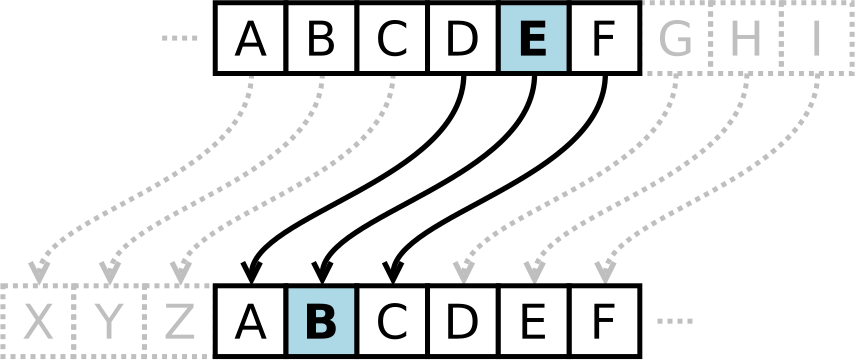
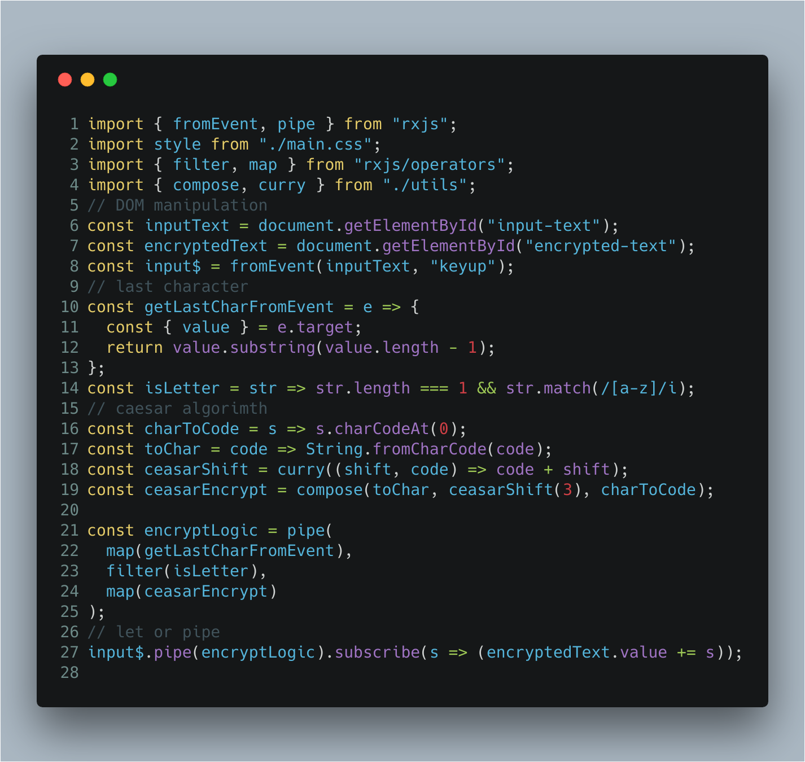

Rx.js 6
--- 
Who I am
---
Introduction to rx
+++
All things are streams
+++
Copia de internnet
---
What's the new in RX6?
---
Migration de v5 -> v6
+++
First vX.Y -> v5.5
- Migrate to pipe
- tslint auto migrate code
+++
Second v5.5 -> v6 compat
- Imports migration
+++
Third v6 compact -> v6
+++
Enjoy
---
Pipeline example
+++
Pipeline function

  https://github.com/ReactiveX/rxjs/blob/master/doc/pipeable-operators.md
+++
Pipeline operator

  https://github.com/tc39/proposal-pipeline-operator
+++
Caesar cipher

+++?image=presentation/assets/66.png&size=contain
+++

+++

+++

+++

+++

+++

+++

+++

+++

+++

+++

+++

+++

+++

+++

